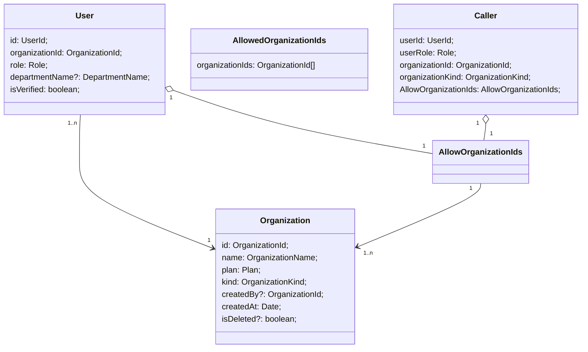

# domain-modeling

```mermaid
classDiagram
    class User {
      id: UserId;
      organizationId: OrganizationId;
      role: Role;
      departmentName?: DepartmentName;
      isVerified: boolean;
    }

    class AllowedOrganizationIds {
      organizationIds: OrganizationId[]
    }

    class Caller {
      userId: UserId;
      userRole: Role;
      organizationId: OrganizationId;
      organizationKind: OrganizationKind;
      AllowOrganizationIds: AllowOrganizationIds;
    }

    class Organization {
      id: OrganizationId;
      name: OrganizationName;
      plan: Plan;
      kind: OrganizationKind;
      createdBy?: OrganizationId;
      createdAt: Date;
      isDeleted?: boolean;
    }

    User "1..n" --> "1" Organization
    User "1" o-- "1" AllowOrganizationIds
    Caller "1" o-- "1" AllowOrganizationIds
    AllowOrganizationIds "1" --> "1..n" Organization
```
